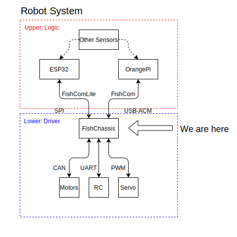

<!--
 * @Description: 
 * @Author: qianwan
 * @Date: 2023-12-19 17:41:51
 * @LastEditTime: 2024-01-30 13:58:35
 * @LastEditors: qianwan
-->
# FishChassis System
*深圳科创学院2024高中生机器人冬令营 底盘嵌入式系统*   
*InnoXSZ 2024 Robotics Winter Camp for High School Students.* 

> FishChassis is provided as a lower layer controller.

>Author: qianwan.Jin@2024
qianwan233@foxmail.com


Get this repository by:   
```bash                                     
git clone https://github.com/RM-camp-for-high-school-students/Shenzhen-innoX-2024wc-chassis.git --recursive --depth=1
```

Related Projects:
- [LibFishChassis - Esp32 Mixly Arduino Package](https://github.com/Q1anWan/LibFishChassis)
- [FishCom - Communication Protocol](https://github.com/Q1anWan/FishCom)
- [Innox2024-WC-WS - ROS Work Space](https://github.com/RM-camp-for-high-school-students/Shenzhen_innoX_2024wc_ws)

## Table of Contents
- [FishChassis System](#fishchassis-system)
  - [Table of Contents](#table-of-contents)
  - [Environment](#environment)
      - [Hardware](#hardware)
      - [Softwares](#softwares)
      - [Packages](#packages)
  - [General Information](#general-information)
      - [Orientation](#orientation)
      - [Robot System Construction](#robot-system-construction)
      - [Communication](#communication)
      - [ELF File Info](#elf-file-info)
      - [RTOS Trace Info](#rtos-trace-info)


## Environment
#### Hardware
- [Development Board Type C](https://www.robomaster.com/zh-CN/products/components/general/development-board-type-c/info)
- [EPS32-C3 Arduino](https://github.com/espressif/arduino-esp32) 

#### Softwares
- Code generator: [STM32CubeMX-6.10.0](https://www.st.com/zh/development-tools/stm32cubemx.html)
- Tools chains: [arm-none-eabi-gcc](https://developer.arm.com/downloads/-/arm-gnu-toolchain-downloads)
- Debugger: [OpenOCD](https://github.com/xpack-dev-tools/openocd-xpack/releases) + GDB(Windows need [mingw64](https://github.com/skeeto/w64devkit/releases))
- Code editor: [Vscode](https://code.visualstudio.com/)/[Clion](https://www.jetbrains.com/zh-cn/clion/)
- Refer tutorial:  [Vscode](https://gitee.com/hnuyuelurm/basic_framework/blob/master/.Doc/VSCode+Ozone%E4%BD%BF%E7%94%A8%E6%96%B9%E6%B3%95.md)/[Clion](https://zhuanlan.zhihu.com/p/145801160)


> Author recommend Clion as IDE for more intelligent. And in this project, both Clion and Vscode are ready to go.   

> Recommended tutorial for initing invironments: [Configuring CLion for STM32 Development-Zhihui Peng](https://zhuanlan.zhihu.com/p/145801160)

> Some present configurations may need to be adjust for your environment. 
> Like: Use clangd need to edit ___.vscode/setting.json___ :    
>   _--query-driver = "your\\arm\\tool\\chain\\bin\\arm-none-eabi-g*"_

#### Packages
- [STM32CubeF4 Firmware Package V1.28.0 - HAL Driver](https://learn.microsoft.com/en-us/azure/rtos/threadx/)
- [STM32CubeExpansion_AZRTOS-F4 V1.1.0 - RTOS](https://learn.microsoft.com/en-us/azure/rtos/threadx/)
- [FishCom - Communication Protocol](Module/Mavlink/README.md)
- [OneMessage - Message System](Module/OneMessage/README.md)
- [WHX EKF - AHRS](https://github.com/WangHongxi2001/RoboMaster-C-Board-INS-Example)


## General Information
#### Orientation


***RFU*** indicates that Right-Forward-Upward is the correct orientation for the chassis.
***Anticlockwise*** rotation direction is positive.
***ZYX*** rotation order is implemented on the robot.
***Right-Forward*** corresponds to the ID-0 wheel, with the IDs increasing counterclockwise.


#### Robot System Construction



FishChassis serves as the foundational layer in the entire robot system. It facilitates basic closed-loop control for actuators and offers a control API for the upper layers.

Here are the details:



- Hardware Layer
  - Supports the running environment for programs.
- Operating System Layer
  - Supports basic system resource management.
- Service Layer
  - Supports advanced system services for apps, such as publisher-subscriber modules, USB-ACM service, etc.
- Task APP Layer
  - Implements user tasks to execute functions.

Here shows how system startup:
  


#### Communication
- USB-ACM
  - Operates  FishCom
  - Appears as tty-acm-x on Linux.
  - Simply plug in the micro-USB to the PC.
  - Well-suited for upper layers.
- SPI
  - Operates FishComLite.
  - Configured for ESP32-Arduino.
  - Not recommended for upper layers.

#### ELF File Info 
```
[Release Optimize]
Memory region         Used Size  Region Size  %age Used
          CCMRAM:       24436 B        64 KB     37.29%
             RAM:       61456 B       128 KB     46.89%
           FLASH:      128992 B       896 KB     14.06%
```

#### RTOS Trace Info 
```
CPU Usage
[CPU IDLE]      83.11%
[IMU]           15.46%
[Wheel]         0.62%
[MsgScheduler]  0.35%
[MsgSPI]        0.17%
[Interrupt]     0.15%
[Remoter]       0.1%
[cdc-acm-write] 0.05%
[Servo]         0.04%
[cdc-acm-write] 0.04%
[IMU_Temp]      <0.01%  
```